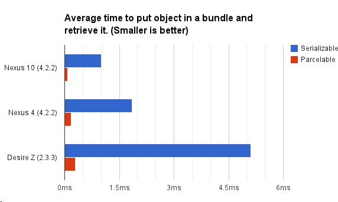

In the last four months, I did some optimization to our company's project.

### Method Count
Some code are written like this:

```java
public void onCreate(Bundle b){
    initData();
    initView();
}
```

The code separate the initilization into two methods in every Activity's onCreate() method. My question is : "Does it necessary?"

Normally, it's fine. But things are different on Android. Android has a 65536 method count limit. Once you pass that limit, thanks to Google, you can still build your project using Google's multidex, but your app is now in a more complex zone. 

Sometimes, you may find some "ClassNotFound" crash because of multidex.

And multidex will make your start up time very long. Because Android need to unzip the multiple dexes and run the app. And this takes time. I saw some project even have a ANR when starting up. That's because of multidex. Once they remove a lot unused method and business logic, this ANR disappear. 

I'm not saying multidex is evi. I just want to get your attention and tell you multidex has some major disadvantage. So if you can, please try your best to shrink you method count below 65536. Proguard will be a helper to help you achieve that. 

Now back to our example, these init***() methods are actually not necessary. You can just avoid this by using comments. Comments are very clear too. You do not need multiple methods to show your intention.

```java
public void onCreate(Bundle b) {
    // init data
    ...
    // init view
    ...
}
```

p.s. This is just an example. You may remember that unnecessary methods should not be created. 


### Enum
Google suggested develop to avoid using Enum.  Here is [what it said](https://developer.android.com/topic/performance/memory.html ) :

```
enums often require more than twice as much memory as static constants. You should strictly avoid using enums on Android.
```
 
About the bad of Enum, you can assume that many Enums may take many memory than static constants.  And [more deails can be seen here](https://www.youtube.com/watch?v=Hzs6OBcvNQE). 

By the way, to help your project code more readable, Google even create `@IntDef` and `@StringDef` to help you organize your code. And `@IntDef` and `@StringDef` are great helper to avoid Enum. 

Here is an example about how to use `@IntDef` to replace Enum:

```java
    public static final int MAN = 1;
    public static final int WOMAN = 2;

    @Retention(RetentionPolicy.SOURCE)
    @IntDef({MAN, WOMAN})
    public @interface SexType{
    }
```

Since the annotation is `SOURCE` level, so you don't have to worry about it affecting your compile-time/runtime performance.

### Serializable
Our project has hundreds of model class that implements Serializable. Of course, they are designed this way so they can be passed between Activities. But this is also a performance hole.

Yes, I agree that Serializable is much easier to write. You just need to add two words `implements Serializable`. But Parceable is much faster. By "much faster", I am talking 3x, even 10x, faster. 

According to [this experiment](http://greenrobot.me/devpost/android-parcelable-serializable), you will notice that difference very easily.




So you should consider to stop using Serializable, and try Parceable. 

I know Parceable is not that easy to write. But don't worry, there are many tools or Android Studio Plugin to help you write Parceable classes. So "it's hard to code" is not an excuse to reject Parceable.

p.s. Actually, you have other options, for example, using FlatBuffer instead of JSON to do the serialization job. But this will bring much changes to your project, so I am not gonna mention the details here.

p.s. By the way, I strongly recommend you to watch this video, [Android Performance](https://www.youtube.com/watch?v=IwxIIUypnTE) by Google. 

### Reference
[http://greenrobot.me/devpost/android-parcelable-serializable](http://greenrobot.me/devpost/android-parcelable-serializable)


1. emnu

2. method count

3. separate logic from UI

4. add unit test

5. open-close principle


