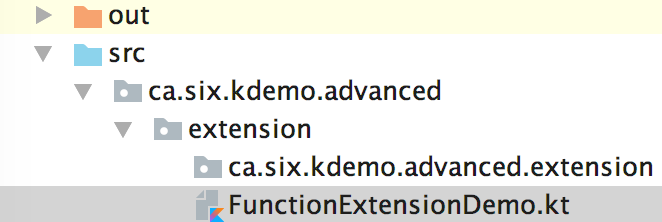
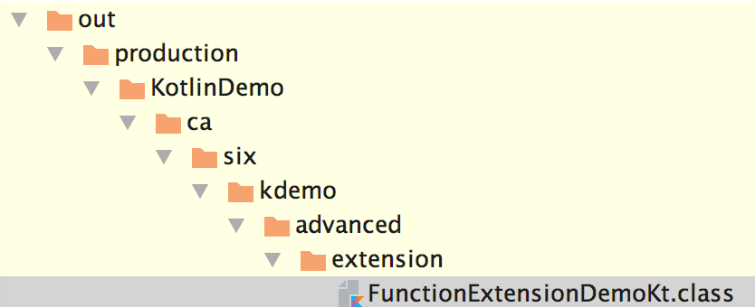

### I. Introduction of Extension Function
As a kotlin user, you must be familiar with these code:
```java
fun EditText.string() : String {
    return this.getText()?.toString() ?: "" //"this" is actually the EditText object
}
```

This kind of extension makes our development life much more easier. Now we can do things like this:

```java
EditText etName = ...;
String name = etName.string()
```
It's like the EditText has the string() method within. 

### II. How Kotlin do it?
By do something like anti compile APK file, We can understand how Kotlin do it.

#### 1. Install Kotlin Command Line Compiler

If you are using a Windows PC, you can unzip the standalone kotlin compiler into a directory and optionally add the bin directory to the system path. The bin directory contains the scripts needed to compile.

If you are a Mac user, you can use HomeBrew to install kotlin.
(1). If you don't have HomeBrew right now,  just paste the code below at a Termianl prompt. 
`/usr/bin/ruby -e "$(curl -fsSL https://raw.githubusercontent.com/Homebrew/install/master/install)"`
(2). If you already have HomeBrew, you can install and cnofig kotlin by enter:
`$ brew install kotlin`

#### 2. Compile Kotlin file
you can just enter:
`$ kotlinc ***.kt`

#### 3. Use javap to understand the *.class file
`$ javap ***.class`
Then you could see what a kotlin file looks like after being compiled.

### III. An Example
Here is one kotlin file
```java
fun String.first(num: Int): String {
    return this.substring(0, num);
}

fun main(args: Array<String>) {
    println("test".first(2))
}
```

After using `kotlinc` and `javap`, we now can see what kotlin really has done in the background. 

Source File                  |  Built File
:-------------------------:|:-------------------------:
 | 

Here is the result after `javap`
```java
$ javap FunctionExtensionDemoKt.class
Compiled from "FunctionExtensionDemo.kt"
public final class ca.six.kdemo.advanced.extension.FunctionExtensionDemoKt {
  public static final java.lang.String first(java.lang.String, int);
  public static final void main(java.lang.String[]);
}
```

