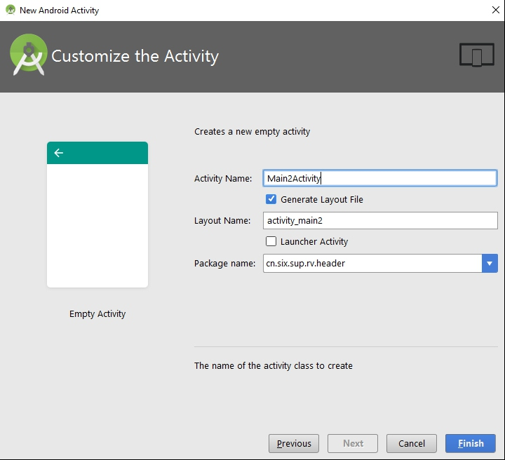
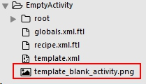
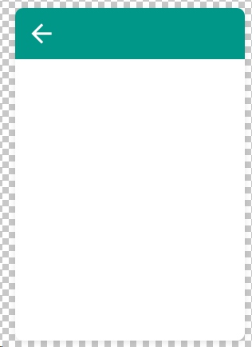
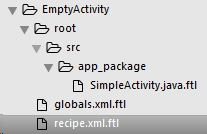

Today I want to introduce another tool to help you improve your  productivity: Activity Template in the Android Studio.

## 1. Introduction


This picture is familiar, right? But have you ever wondered what these templates come from when you new a project or an Activity?

Actually, they are come from the directory : "`%Android Studio Installed Directory%`\plugins\android\lib\templates\activities\EmptyActivity".    (`%Android Studio Installed Directory%` is the directory where you install the AndroidStudio.)

Let us open this directory, and take a look:


Yes, now you can find where the "Empty Activity", "Fullscreen Activity", "Basic Activity" come from ; they are all here.

We actually can take advantage of it to make our own Activity template for us, after getting familiar with the Activity Template.

Here is some developer's output:


(the picture is from: [Hongyang's blog](http://blog.csdn.net/lmj623565791/article/details/51592043) )

Pretty awesome, right?  

## 2. Learning from existing template

Before we make our own template, we should get know how to make a template. And the best way to do that is to learn from the existing template, especially the easiest one. 

In all the templates that already exist in the plugin directory, `EmptyActivity` is the simplest example. Let us have a loot at it.

Open the "EmptyActivity" directory, we found the structure of this directory is this:


### 2.1. template.xml
template.xml is like the layout xml in our Android project. It tells Android Studio how to draw a UI. 

For example, Empty Activity Template looks like this:



You have three EditText for you to input the name, and two CheckBox to select.  And the template will have these five element to draw them. 

A steamlined code of template.xml is like this:
```xml
<?xml version="1.0"?>
<template description="Creates a new empty activity">

    <parameter id="activityClass" name="Activity Name"
        type="string" default="MainActivity" />

    <parameter id="generateLayout" name="Generate Layout File"
        type="boolean" default="true" />

    <parameter id="layoutName" name="Layout Name"
        type="string" constraints="layout|unique|nonempty"
        visibility="generateLayout"/>

    <parameter id="isLauncher" name="Launcher Activity"
        type="boolean" default="false" />
    
    <parameter id="packageName" name="Package name"
        type="string" constraints="package"
        />

    <thumbs>
        <thumb>template_blank_activity.png</thumb>
    </thumbs>

    <globals file="globals.xml.ftl" />
    <execute file="recipe.xml.ftl" />

</template>

```

#### 2.1.1 parameter
It is easy to find out that every `<parameter>` element is one input UI View in the previous picture. 

Take an examploe of the first `<parameter>`,  ActivityName, the code is like below:

```java
    <parameter
        id="activityClass"
        name="Activity Name"
        type="string"
        constraints="class|unique|nonempty"
        suggest="${layoutToActivity(layoutName)}"
        default="MainActivity"
        help="The name of the activity class to create" />
```

And the UI is like this:


* Thd `id` attribute : It's like `android:id="@+id/etActivityName"`. You can use the "id" to get this UI View's text.
* The `name` attribute is the text in the left, "Activity Name:"
* The `type` attribute: String or boolean. If the value is String, then it will show as a EditText. If the value is boolean, then it will show as a CheckBox. (just like `<parameter id="isLauncher">`)
* The `constraints` attribute: "class|unique|nonempty" value is not hard to understand.

#### 2.1.2  thumb
```xml
    <thumbs>
        <thumb>template_blank_activity.png</thumb>
    </thumbs>
```

"template_blank_activity.png" is in the root directory of "EmptyActivity" directory. 



It looks like this:



Yes, this is the picture in the left of the UI.

#### 2.1.3 globals and execute  
```xml
    <globals file="globals.xml.ftl" />
    <execute file="recipe.xml.ftl" />
```
Template refers "globals" and "execute". What are those two files?

Let me tell the conclusion first. 
* "global.xml.ftl" : It's like a global configuration file
* "recipte.xml.ftl": It's like the main function in Java. It help transfer the "template.xml" to our plugin.

[global.xml.ftl] 

```xml
<?xml version="1.0"?>
<globals>
    <global id="hasNoActionBar" type="boolean" value="false" />
    <global id="parentActivityClass" value="" />
    <global id="simpleLayoutName" value="${layoutName}" />
    <global id="excludeMenu" type="boolean" value="true" />
    <global id="generateActivityTitle" type="boolean" value="false" />
    <#include "../common/common_globals.xml.ftl" />
</globals>
```

global.xml.ftl is like a class that holds all the global values. 

Note that the global.xml.ftl also includes the common globals files, which is a common file that all the templates can use.

[recipt.xml.ftl]

```xml
<?xml version="1.0"?>
<recipe>
    ... ... 
    <instantiate from="root/src/app_package/SimpleActivity.java.ftl"
                 to="${escapeXmlAttribute(srcOut)}/${activityClass}.java" />

    <open file="${escapeXmlAttribute(srcOut)}/${activityClass}.java" />
</recipe>
```



* "instantiate" element is used to make the template file(aka. src/app_package/SimpleActvity.java.ftl) to become our target file (in this case, ${activityClass}.java)
And ${activityClass} is one of the parameters in the "template.xml". Remeber?

```xml
    <parameter id="activityClass" name="Activity Name"
        type="string" default="MainActivity" />
```
As we said before, we can use the "id" attribute to get the activity name.

And the content of template file is:

```java
// [SimpleActivity.java.ftl]
package ${packageName};

import ${superClassFqcn};
import android.os.Bundle;

public class ${activityClass} extends ${superClass} {

    @Override
    protected void onCreate(Bundle savedInstanceState) {
        super.onCreate(savedInstanceState);
<#if generateLayout>
        setContentView(R.layout.${layoutName});
</#if>
    }
}
```
    * {packageName}, {superClassFqcn}, {superClass} : They are all from "../common/common_globals.xml.ftl"
    * {activityName}, {generateLayout}, {layoutName} : These are all from "template.xml"

* "open" element will open the target file in the Android Studio after generating the target file. 


