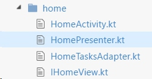

Test the kotlin project is a new thing. I am glad I have some experience about that and want to introduce it to everyone. Here is what I do.

#### 1. The kotlin project
My project has a main screen, and I have HomeActivity and HomePresenter classes for it. Remember these are two kotlin class, so the file names are : "HomeActivity.kt" and "HomePresenter.kt".





Here is some code of HomePresenter.kt:

```java
open class HomePresenter(var view : IHomeView) {
    var repo = getTaskRepository() // Injection
    var items = arrayListOf<TaskItem>() // a copy data from DataBase

    fun getTaskList(){
        items = repo.getAllTasks()
        view.refreshTaskList()
    }
    ....
```

### 2. start to test the HomePresenter -- using java
We already introduce how to test the Presenter before. Now the only question is  how can we be sure java can access kotlin class?  We know kotlin can access java classes, but how about the opposite direction?

The answer is yes. Yes, you can have java classes access kotlin classes. 

##### 2.1 setup()

```java
public class HomePresenterTest {
    private ITaskRepository repo;
    private HomePresenter presenter;
    private IHomeView  view;

    @Before
    public void setUp(){
        view = mock(IHomeView.class);

        repo = new FakeTaskRepository();
        presenter = new HomePresenter(view);
        presenter.setRepo(repo);
    }
```
You see, although IHomeView and HomePresenter is kotlin classes, you can still access them in java class. Because those kotlin class will be converted to "*.class" file eventually. This way, our java classes can access them.

##### 2.2 testGetTaskList()

```java
    @Test
    public void getTaskList(){
        presenter.getTaskList();
        List<TaskItem> data = presenter.getItems();
        assertEquals(3, data.size());
        assertEquals(2, data.get(0).getId());
        assertEquals("Costco", data.get(0).getTitle());

        verify(view).refreshTaskList();

    }
```

Here is a little tricky. The HomePresenter is like this:

```java
open class HomePresenter(var view : IHomeView) {
    var repo = getTaskRepository() // Injection
    var items = arrayListOf<TaskItem>() // a copy data from DataBase
```

the `repo` and `items` field seems "public". But they are actually converted to "setRepo()", "getRepo()", "setItems()" and "getItems()" four methods.

That's why we should use "data.getItems()" in the test class, which is written by java. You cannot just use "data.items". This is a kotlin way to access the field, not a java way.

You may wonder, how should I know what kind of result will a field, or a method, or a class in kotlin become eventually? Don't worry, the IDE(Android Studio) will give you a hand.  


Just like this, you see

### 3. another solution
Of course, you can test the kotlin project with Kotlin. All you have to do is just add the kotlin dependency to "test" build variant.

