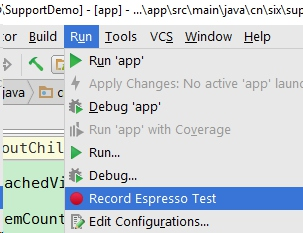
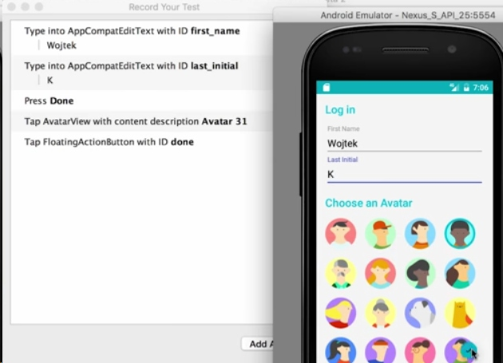
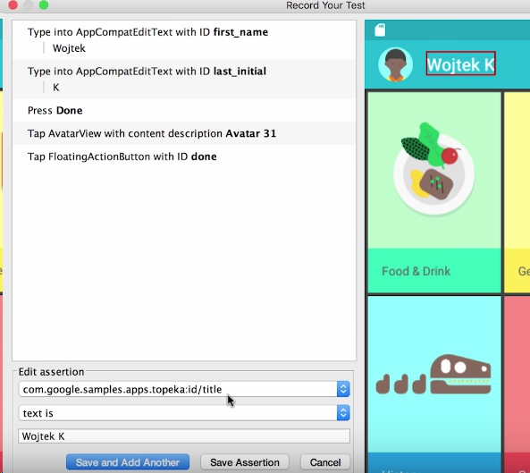
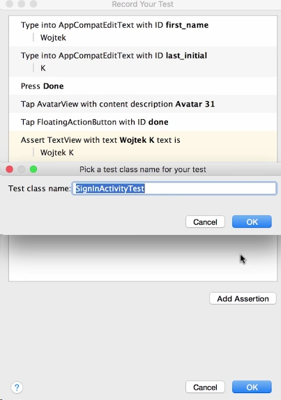
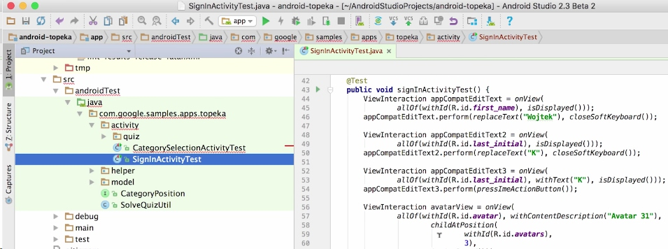

Android Studio 2.3 has a new feature called "Espresso Test Recorder". Years ago, my iOS colleague told me that iOS has such a recorder tool that record your actions, and can replay this script as a test. I was like, "what, that's awsome". Now I am proud that Android has such a test tool too. 

#### Espresso
For who is not familiar with Espresso, please [see here](https://developer.android.com/training/testing/ui-testing/espresso-testing.html). I've used Espresso to test a SDK in my previous company. Back then, with the help of Jacoco, we knew that our Espresso test cases covers more than 80% of source code, which made us very proud. My previous company had a KPI for us and asked us to cover at least 70% of source code, and we were fulfill this goal. In conclusion, all I want to say is I've used Espresso successfully, and I think Espresso is good enough for you to do UI test, so please use it. No more excuses for not adding tests.

#### Steps to use Espresso Test Recorder
Here is how to use Espresso Test Recorder:

step1.  "Run" menu --> "Record Espresso Test". Select an emulator or a device. And the recorder will run your app in debug mode.

step2. You can type, select, click as a normal user, and the recorder will record every action you made at the same time. At last, all you actions will generate a "*.java" test files.

step3. Add assertion
If there is only actions, this is not a test. You must add your assertion to know if the app runs well or not.

In Espresso Test Recorder, you have to click one view to add a assert:

step4. Generate the test file

And you will get a new file:

This is familiar if you wrote Espresso before, right?

#### Current limitations
1. Only some of view assertions are available thourgh this recorder tool.
2. For those synchronization scenario, Espresso Test Recorder does not support it too. Because it's a little complex for this tool. You have to use IdlingResource flag by yourself.

In those scenario, you have to write your own code by hand. Hope Android Studio will make it better in the furture. 

#### Reference 
[Google's Espresso Test Recorder Video](https://www.youtube.com/watch?v=JRkDVvB106k)

