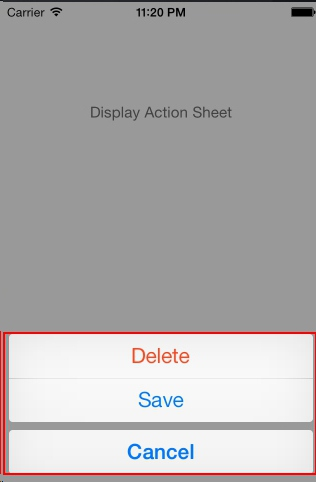

## A. Introduction
ActionSheet is an UI widget in iOS. It looks like :<br/>

<br/>
When you active an ActionSheet, you will get a blur background and a window that pops up at the bottom. 

Fortunately, [baoyongzhang](https://github.com/baoyongzhang) open sourced an ActionSheetForAndroid library for us. [This project](https://github.com/baoyongzhang/android-ActionSheet) is great, it even supplies a iOS6 and a iOS7 styles.

However, what if I want to customer this library?

## B. Customize Action Sheet
### B1. Get to know ActionSheetForAndroid
Before we start to custom our own ActionSheet, we should get to know the ActionSheetForAndroid  libray first. It may help us understand how an ActionSheet works.

We have some quetions before we start to dig the code:
* How to blur the background?
* How to make the ActionSheet animated?
* What makes up the ActionSheet?
* How to show ActionSheet in the top of our screen?

#### I. How to blur the background?
This is the easiest part. What you have to do is just to change the background's alpha from 255 to 136.


For example, you have a big frameLayout, now you call
```java
flay.setBackgroundColor(Color.argb(136,0,0,0);
```
and you will have a blur background.

#### II. How to make the ActionSheet animated?
This is not difficult too. You only have to declare a `TranslateAnimation` and apply it.

```java
        int type = TranslateAnimation.RELATIVE_TO_SELF;
        TranslateAnimation an = new TranslateAnimation(type, 0, type, 0, type, 0, type, 1);
        an.setDuration(duration);
        an.setFillAfter(true);
```       


#### III. What makes up the ActionSheet?
This is a little difficult. You are like an surgeon having a anatomy. Actually, the ActionSheet has two parts. One is the the FrameLayout which matches the whole screen, and one is the buttons.

The structure of ActionSheet is :<br/>
```
FrameLayout (background is #8000)<br/>
	-> LinearLayout (vertical, at the bottom)<br/>
		-> Button Delete<br/>
		-> Button Save<br/>
		-> Button Cancel<br/>
```




#### IV. How to show ActionSheet in the top of our screen?
Firstly, I have to talk about `DecorView` on Android. Well, it is defined in [Romain Guy's Blog](http://www.curious-creature.org/2009/03/04/speed-up-your-android-ui/):

`The DecorView is the view that actually holds the window’s background drawable. Calling getWindow().setBackgroundDrawable() from your Activity changes the background of the window by changing the DecorView‘s background drawable. As mentioned before, this setup is very specific to the current implementation of Android and can change in a future version or even on another device.`

You can simply see DecorView as your phone screen. When it add one View, the View will on top of the other views, which is a feature we need in the ActionSheet.

```java
        decorView = (ViewGroup) (((ViewGroup) actv.getWindow().getDecorView().findViewById(android.R.id.content)).getChildAt(0));;
        decorView.addView(actionSheetView);
```
This code will make sure our ActionSheet is on top of every other layer.

For more information about DecorView, please see [here](http://blog.csdn.net/u012422440/article/details/51173387) (an Chinese blog).

### B2. Customize Our Action Sheet
Sometimes you get the requirement that pops up image, rather than buttons from the button. What should you do?

Yes, just remake the structure.<br/>
```
FrameLayout (background is #8000)<br/>
	-> LinearLayout (vertical, at the bottom)<br/>
		-> ImageView<br/>
```


## C. Conclusion
The implementation of the ActionSheet is not difficult. But you can learn something about DecorView, Animation, and customing a View. You definitely should try it yourself.

p.s. Android support Libray 23.2 actually publish a class called [android.support.design.widget.BottomSheetBehavior](https://developer.android.com/reference/android/support/design/widget/BottomSheetBehavior.html?utm_campaign=android_launch_supportlibrary23.2_022216&utm_source=anddev&utm_medium=blog) that can also implement such a feature. But there are a little difference between these two classes in UI. 


At last, [Here is the code.](https://github.com/songzhw/SixUiViews/tree/master/app/src/main/java/cn/six/open/view/customactionsheet)


